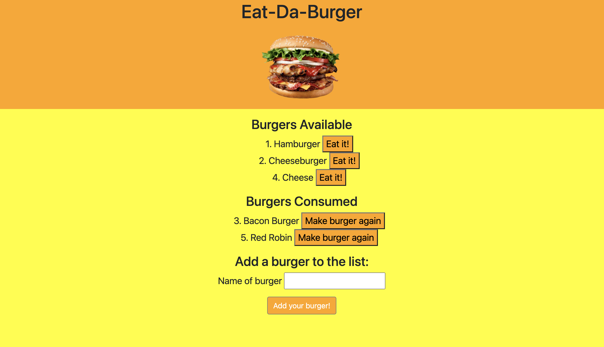

# Burger Express Handlebars

This project is to use the handlebars interface to make a database for burgers that have been eaten and not

## Installation

* If using app, run `npm install` in command line
* After that, run `node server` and click on the link provided in the console.
* Otherwise, use the [heroku link](https://blooming-sierra-90194.herokuapp.com/burgers)

## Instructions
1) Open the app.
2) Type in a burger you'd like to eat
3) Once that burger is on the screen, you can choose to click the button next to it to either consume the burger or order it again!

## Screenshots

## Questions

For any questions, please contact me at:

**Email:** calebhopkins@outlook.com

**GitHub Profile:** [CalebTheCreative]("https://github.com/CalebTheCreative")